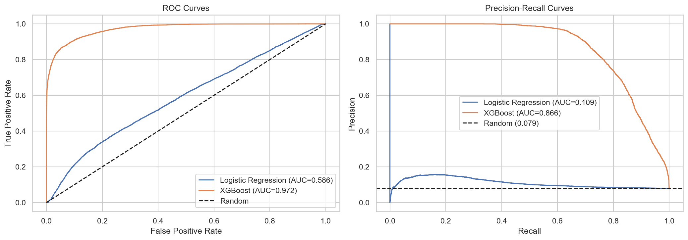
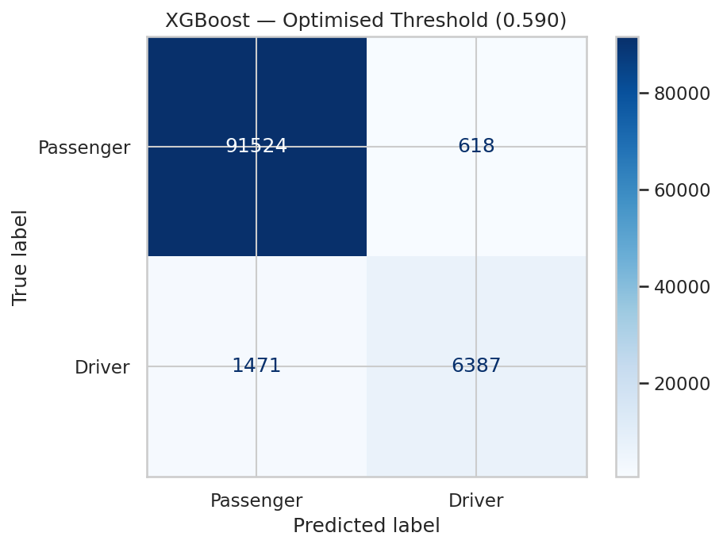
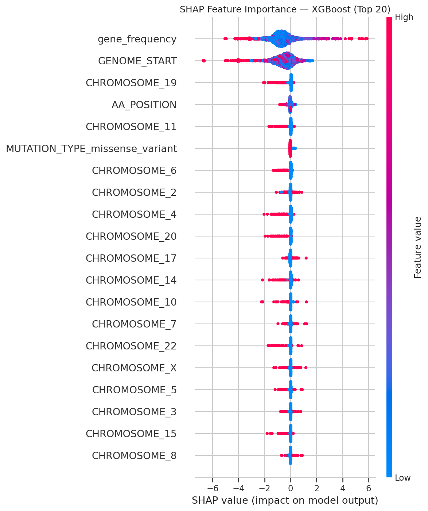

# 🧬 Classification of Cancer Driver vs Passenger Mutations

> Using Sequence & Genomic Context Features

A single-notebook machine-learning pipeline that distinguishes **cancer driver mutations** from **passenger mutations** using features derived from the [COSMIC](https://cancer.sanger.ac.uk/cosmic) database (v103, GRCh37).

---

## 🔬 The Problem

Every tumour carries thousands of somatic mutations, but only a tiny minority — **driver mutations** — actually cause the cancer to grow and spread. The vast majority are **passenger mutations** that accumulate by chance with no functional impact. Reliably telling them apart is one of the hardest open problems in precision oncology.

This project frames the problem as a **binary classification task**: given a somatic mutation's sequence-level and genomic-context features, predict whether it lies in a known cancer driver gene (`is_CGC = 1`) or not (`is_CGC = 0`).

---

## 🏆 Key Results

| Model | ROC-AUC | PR-AUC | MCC | F1 | Precision | Recall |
|-------|---------|--------|-----|-------|-----------|--------|
| Logistic Regression | 0.586 | 0.109 | 0.067 | 0.169 | 0.101 | 0.503 |
| XGBoost (default thresh) | 0.988 | 0.929 | 0.825 | 0.838 | 0.797 | 0.883 |
| **XGBoost (thresh 0.59)** | **0.988** | **0.929** | **0.850** | **0.859** | **0.912** | **0.813** |
| LightGBM | 0.955 | 0.810 | 0.587 | 0.602 | 0.471 | 0.836 |
| Ensemble (XGB + LGBM) | 0.978 | 0.894 | 0.743 | 0.760 | 0.682 | 0.859 |

**Best model:** XGBoost with optimised threshold (0.59) — **PR-AUC 0.929**, **Precision 91.2%**, **F1 0.859**.
<p align="center">
  
  <br>
  <em><strong>Left:</strong> ROC curves. <strong>Right:</strong> Precision-Recall curves. XGBoost and the Ensemble heavily outperform the linear baseline on this severely imbalanced dataset.</em>
</p>
---

## 📁 Project Structure

```
.
├── README.md                                  # This file
├── cancer_mutation_classification.ipynb       # The complete end-to-end pipeline
├── .gitignore                                 # Git ignore rules
│

└── eda/                                       # Additional saved EDA figures
```

> **`cancer_mutation_classification.ipynb`** is the only notebook you need. It contains the entire pipeline from raw data ingestion through to final model evaluation, all in one place.

---

## 🔄 Pipeline Overview

The master notebook is organised into four stages:

### Stage 1 — Data Preprocessing
- Chunk-reads the 12 GB raw COSMIC TSV in 100K-row blocks (memory-safe)
- Filters for confirmed somatic, protein-altering mutations (missense, stop-gained, frameshift, splice, in-frame)
- Merges with the Cancer Gene Census to create the binary `is_CGC` label
- Deduplicates and samples 500K rows for modelling

### Stage 2 — Exploratory Data Analysis
- Visualises class distribution (~92% passenger vs ~8% driver)
- Analyses top mutation types and most frequently mutated genes
- Identifies patterns that inform feature engineering

<p align="center">
  
  <br>
  <em>The massive class imbalance (roughly 12:1 ratio) constrained our metrics, necessitating careful threshold tuning and the use of PR-AUC.</em>
</p>

<p align="center">
  
  &nbsp;
  
  <br>
  <em><strong>Left:</strong> Missense mutations significantly dominate the data. <strong>Right:</strong> Massive genes like TTN accumulate passengers by sheer length, whereas tumor suppressors like TP53 are dense hot-spots for genuine drivers.</em>
</p>

### Stage 3 — Feature Engineering & Model Training
- Engineers **65 features** across five categories:
  - **Mutation type** — one-hot encoded consequence
  - **Amino-acid properties** — physicochemical class, radical-change flag, position
  - **Nucleotide substitution** — 12 SNV transitions + indel/complex
  - **Chromosomal context** — one-hot chromosome + genomic coordinate
  - **Gene-level frequency** — per-gene mutation count (leak-free)
- Trains Logistic Regression, XGBoost (with RandomizedSearchCV tuning), LightGBM, and an ensemble
- Uses 5-fold stratified cross-validation with PR-AUC as the primary metric

### Stage 4 — Evaluation & Interpretability
- Evaluates all models on a held-out 20% test set
- Optimises the decision threshold (0.50 → 0.59) to maximise F1
- Generates ROC & PR curves, confusion matrices, and SHAP feature importance plots
- Performs McNemar's test for statistical significance between models

<p align="center">
  
  &nbsp;
  
  <br>
  <em><strong>Left:</strong> The optimally tuned XGBoost model reduces False Positives to just 618 while maintaining high recall. <strong>Right:</strong> SHAP breakdown of feature attributes showing that Gene Mutation Frequency is overwhelmingly the most predictive signal, followed by absolute genomic coordinate positions.</em>
</p>

---

## 📊 Data

| Dataset | Source | Description |
|---------|--------|-------------|
| **GenomeScreensMutant v103** | COSMIC | ~13.6 M somatic mutation records |
| **CancerGeneCensus v103** | COSMIC CGC | Known cancer driver genes (Tier 1 & 2) |

### Data Setup

The raw COSMIC files are too large (~12 GB) for GitHub and are excluded via `.gitignore`.

**Option A — Download from Kaggle (recommended):**

1. Download the preprocessed dataset from Kaggle:
   👉 **[Cancer Driver vs Passenger Somatic Mutations](https://www.kaggle.com/datasets/arjunb1204/cancer-driver-vs-passenger-somatic-mutations)**
2. Place the downloaded `gsm_clean_with_cgc.tsv` file in the `preprocessed data/` directory
3. Run `cancer_mutation_classification.ipynb` — the notebook will automatically detect the preprocessed file and skip raw data ingestion

**Option B — Run from raw data:**

1. Register for a free academic account at [COSMIC Downloads](https://cancer.sanger.ac.uk/cosmic/download)
2. Download:
   - `Cosmic_GenomeScreensMutant_v103_GRCh37.tsv`
   - `Cosmic_CancerGeneCensus_v103_GRCh37.tsv`
3. Place both files in the `raw data/` directory
4. Run all cells in `cancer_mutation_classification.ipynb` — Stage 1 will process the raw files from scratch

---

## 🚀 Getting Started

### Prerequisites

- Python 3.10+
- Jupyter Notebook or JupyterLab

### Installation

```bash
# Clone the repository
git clone https://github.com/<your-username>/Classification-of-Cancer-Driver-vs-Passenger-Mutations.git
cd Classification-of-Cancer-Driver-vs-Passenger-Mutations

# Create a virtual environment (recommended)
python -m venv .venv
source .venv/bin/activate  # Linux/macOS
# .venv\Scripts\activate   # Windows

# The notebook contains a cell to install required dependencies via pip
```

### Running the Pipeline

```bash
jupyter notebook cancer_mutation_classification.ipynb
```

Run all cells top-to-bottom. If raw data is missing, the notebook will print:

```
Raw file not found: raw data/Cosmic_GenomeScreensMutant_v103_GRCh37.tsv
Skipping raw ingestion — using preprocessed data instead.
```

…and proceed automatically.


## 📚 References

1. Sondka, Z. et al. (2018). *The COSMIC Cancer Gene Census.* Nature Reviews Cancer, 18(11), 696–705. [DOI](https://doi.org/10.1038/s41568-018-0060-1)
2. Tate, J.G. et al. (2019). *COSMIC: the Catalogue Of Somatic Mutations In Cancer.* NAR, 47(D1), D941–D947. [DOI](https://doi.org/10.1093/nar/gky1015)
3. Vogelstein, B. et al. (2013). *Cancer genome landscapes.* Science, 339(6127), 1546–1558. [DOI](https://doi.org/10.1126/science.1235122)
4. Chen, T. & Guestrin, C. (2016). *XGBoost: A Scalable Tree Boosting System.* KDD 2016. [DOI](https://doi.org/10.1145/2939672.2939785)
5. Ke, G. et al. (2017). *LightGBM: A Highly Efficient Gradient Boosting Decision Tree.* NeurIPS 2017. [Paper](https://papers.nips.cc/paper/2017/hash/6449f44a102fde848669bdd9eb6b76fa-Abstract.html)
6. Lundberg, S.M. & Lee, S.-I. (2017). *A Unified Approach to Interpreting Model Predictions.* NeurIPS 2017. [Paper](https://papers.nips.cc/paper/2017/hash/8a20a8621978632d76c43dfd28b67767-Abstract.html)
7. Saito, T. & Rehmsmeier, M. (2015). *The Precision-Recall Plot Is More Informative than the ROC Plot.* PLoS ONE, 10(3), e0118432. [DOI](https://doi.org/10.1371/journal.pone.0118432)
8. Bailey, M.H. et al. (2018). *Comprehensive Characterization of Cancer Driver Genes and Mutations.* Cell, 173(2), 371–385. [DOI](https://doi.org/10.1016/j.cell.2018.02.060)

---

## 📄 License

This project is for academic and research purposes. COSMIC data is subject to the [COSMIC Terms of Use](https://cancer.sanger.ac.uk/cosmic/terms).
